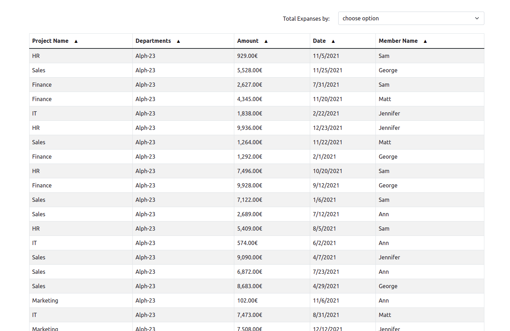
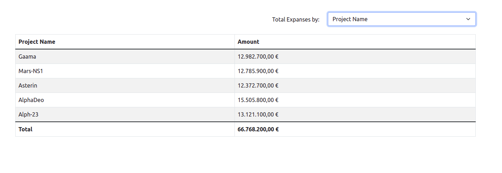

# Pectus Finance


Expense data in tabular with sort and filter with the click on '▲'.



By changing the option you can see the result of the expense calculation.


## Packages

- react, typescript
- bootstrap, react-bootstrap
- cypress, jest, @testing-library/react
- papaparse, eslint, prettier

## Installation

App requires [Node.js](https://nodejs.org/) v14+ to run.

Install the dependencies and start the project.

```sh
cd project
npm install
```

#

## How to use

### commands

1- run the app

```sh
npm run start
```

2- run unit test

```sh
npm run test
```

3- run e2e test

```sh
npm run cypress:open
```

4- run lint and fix error

```sh
npm run lint
npm run lint:fix
```

5- run format

```sh
npm run format
```

6- for production

```sh
npm run build
```

### Thanks

Thank you for your consideration and I hope to join your team soon :)  
here are my <mehdi.kindly@gmail.com> and [website](https://www.mahdifalamarzi.info).
